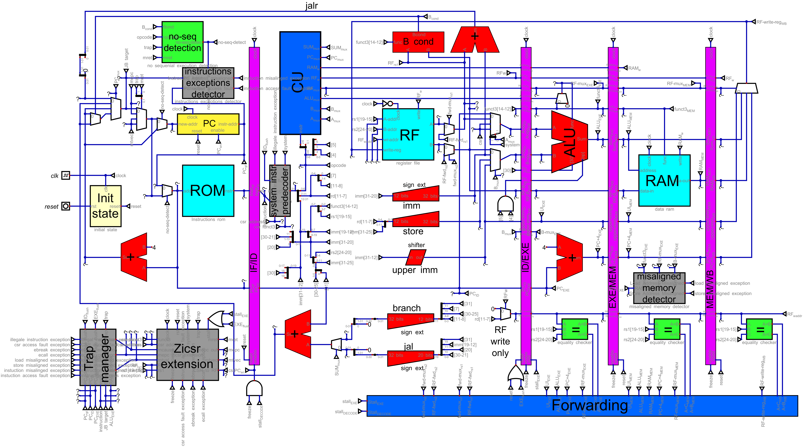
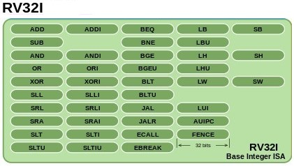

# RISC-V-5P
This open-source project is an implementation of the modern and growing in popularity [RISC-V](https://en.wikipedia.org/wiki/RISC-V) processor, based on a [pipelined](https://en.wikipedia.org/wiki/Instruction_pipelining) microarchitecture that increases instruction execution speed. More specifically, it's an improvement on the previous [single-cycle](https://enesharman.medium.com/single-cycle-vs-multi-cycle-processors-1c5bf468c569) [RISC-V 1C](https://www.el-kalam.com/projets/processeur-risc-v-1c/) implementation of the same processor. What distinguishes this implementation from others found online is its visual nature (you can see its diagram in the image below), rather than its text-based (code-based) approach. It's designed for educational use within Helmut Hneemann's [Digital](https://github.com/hneemann/Digital) Logic Simulator, employing color coding and an organized layout to facilitate tracking signal flow within the processor's internal components during execution. It even allows step-by-step execution with full access to all internal processor entities, and all the data and information is probed throughout the datapath. Furthermore, the simulator can generate [Verilog](https://en.wikipedia.org/wiki/Verilog) or [VHDL](https://en.wikipedia.org/wiki/VHDL) code, enabling integration with standard hardware development tools. Included with this project, a slightly modified version of a source code for the processor in Verilog, used to be intergrated with the [FPGA](https://en.wikipedia.org/wiki/Field-programmable_gate_array), that allows to implement this processor in a real-world physical construction.



### 🎨 Architecture Color Map

-  **Memory Units** (ROM, RAM, RF)
-  **ALU / Arithmetic**
-  **Control & Forwarding**
-  **Pipeline stages separation**
-  **Hazard Detection**
-  **Trap & Zicsr**
-  **Muxes & Gluelogic**

## 🚀 How to Run

To simulate this processor, you will need the **Digital** logic simulator. 
> [!TIP]
> Download it here: [HNeemann/Digital](https://github.com/hneemann/Digital)

### 1. Initial Setup
1. Clone this repository: `git clone https://github.com/kara-abdelaziz/RISC-V-5P.git`, or download directly the zip file
2. Open **Digital**.
3. Go to `File -> Open` and select the main circuit file `cpu.dig`.

### 2. Loading the Program (Instruction ROM)
By default, the ROM is already loaded by the [Dhrystone](https://en.wikipedia.org/wiki/Dhrystone) benchmark code, and it is possible to pass directly to start `Running the simulation`. But it is more interesting to load your proper program. There are two ways to load code into the Instruction Memory:

#### Method A: Manual Entry
Use this for testing a specific instruction, short tests, or debugging:
1. Reaching the light-blue **ROM** component by right-clicking (you probably need to select `instructions rom.dig`), then by clicking the **Open Circuit** button.
2. The circuit `instructions rom.dig` will open, right-click on **ROM**.
3. On **Basic** tab you have to click the **edit** button.
4. Enter your hex machine code values manually into the table.
5. Click **OK**, and don't forget to save `instructions rom.dig` circuit.

Using this method, there are 2 files in `circuits` directory, containing the appropriate code for testing specific instructions and small programs:
1. [all_instructions_test.asm](circuits/all_instructions_test.asm): a small program with the corresponding hexadecimal machine code for each instruction, that tests all the instructions.
2. [test_ROM.hex](circuits/test_ROM.hex): a collection of small programs with the corresponding hexadecimal machine code, designed to test specific instructions.

#### Method B: Loading a Hex File
This is the fastest way to run large programs. Digital supports **Logisim v2.0 raw** and **Intel Hex** file formats.
1. Reaching the light-blue **ROM** component by right-clicking (you probably need to select `instructions rom.dig`), then by clicking the **Open Circuit** button.
2. The circuit `instructions rom.dig` will open, right-click on **ROM**.
3. On **Advanced** tab you have to check the **reload at model start** box.
4. Select your `.hex` in the **file** field.
5. Click **OK**, and don't forget to save `instructions rom.dig` circuit.

In this case, you have the directories `tests` and `benchmarks` containing many .hex files that could be loaded and executed directly. It is also possible to generate your own .hex file following one of the two formats **Logisim v2.0 raw** or **Intel Hex**. Files like **Logisim v2.0 raw** could be generated with the help of the linux script [convert_to_hex.sh](tests/convert_to_hex.sh) in `tests` directory. It was used to convert .dump files of the [riscv-tests](https://github.com/riscv-software-src/riscv-tests) suite to .hex files. You can also use the **Intel Hex** file format by using the official RISC-V toolchain and compiler [riscv-gnu-toolchain](https://github.com/riscv-collab/riscv-gnu-toolchain), containing some specific tools allowing the generation of **Intel Hex** file format.

#### 🛠️ Using the Conversion Script
If you have your own `.dump` files and want to generate a Digital-compatible Instruction Hex file, use the provided bash script:

```bash
chmod +x convert_to_hex.sh
./convert_to_hex.sh path/to/your_file.dump
```
### 3. Running the Simulation
1. Click the **Start** button (the green "Play" triangle) in the toolbar.
2. Toggle the `Reset` input to initialize the PC to `0x80000000`.
3. Toggle the clock `clk` input to run the simulation step-by-step.
4. It is also possible to fix a frequency speed for the clock and let the simulation run automatically.

## Instruction Set Architecture (ISA)

The processor can be described as a 5-stage pipelined RISC-V RV32I processor; it is a 32-bit processor with integer operations. The complete set of implemented instructions is shown in the table below. The processor implements only machine mode (m-mode), including privileged instructions from the Zicsr extension (CSRRW, CSRRS, CSRRC, CSRRWI, CSRRSI, CSRRCI) and other privileged instructions such as ECALL, EBREAK, MRET, and WFI.



## Priviliged layer

The most important CSR registers are implemented; a list of all implemented registers is shown in the table below. The trap mechanism is implemented for interrupts and exceptions; interrupt connections are accessible, but no interrupt handler is implemented. However, the most common exceptions are implemented. A list of all exceptions is shown in the table below.


## Implementation

As you can see on the [datapath](https://en.wikipedia.org/wiki/Datapath) (in the first image at the top), the processor is structured around the five standard stages of a pipelined processor: IF, ID, EXE, MEM, and WB. For clarity, a color code is used to distinguish the functions of the processor components. For example, the four purple bars represent the buffer registers separating the pipeline stages. The components in red represent the arithmetic units, such as the ALU, adders, sign-extenders, a shifter, and a comparator (the B cond, for Branch Condition). Multiplexers are in white, as are the gluegates. Memory, such as ROM, RAM, and the Register File (RF), are in light blue. The normal color blue represents the control units, the CU, and the forwarding manager. Hazard management units are in green. The Program Counter is in yellow. The units in gray are responsible for privileged mode, such as the implementation of the Zicsr extension and the trap manager.

The implementation of the pipeline is relatively complex, which implicitly encourages the use of many other underlying techniques such as feed forwarding, stalling, branch prediction, pipeline flushing, hazard handling.

## Testing and validation

To ensure the processor functions correctly according to the official RISC-V [specifications](https://riscv.atlassian.net/wiki/spaces/HOME/pages/16154769/RISC-V+Technical+Specifications), we chose the official test suite provided by the [organization](https://riscv.org/), called the [riscv-tests](https://github.com/riscv-software-src/riscv-tests) suite. This is a set of unit tests designed to verify the functional correctness of RISC-V architecture implementations, specifically its [instruction set](https://en.wikipedia.org/wiki/Instruction_set_architecture). These assembly language tests verify the conformity of the instructions to the preferred RV32I architecture to guarantee that the designed processor meets the RISC-V specifications. The RISC-V 5P processor successfully passes the tests, except for the fence.i instruction, which is not implemented, and memory misalignment, for which we opted for a simpler software solution rather than a hardware one.

## Website link
The website of the author of this project, that contains this project and many other similar projects : https://www.el-kalam.com/
