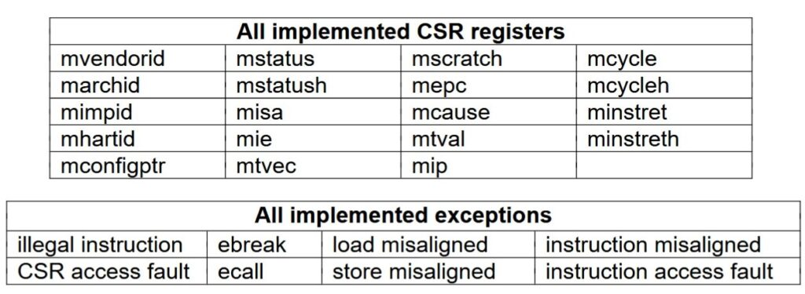

# RISC-V-5P
This open-source project is an implementation of the modern an growing in popularity [RISC-V](https://en.wikipedia.org/wiki/RISC-V) processor, based on a [pipelined](https://en.wikipedia.org/wiki/Instruction_pipelining) microarchitecture that increases instruction execution speed. More specifically, it's an improvement on the previous [single-cycle](https://enesharman.medium.com/single-cycle-vs-multi-cycle-processors-1c5bf468c569) [RISC-V 1C](https://www.el-kalam.com/projets/processeur-risc-v-1c/) implementation of the same processor. What distinguishes this implementation from others found online is its visual nature (you can see its diagram in the image below), rather than its text-based (code-based) approach. It's designed for educational use within Helmut Hneemann's [Digital](https://github.com/hneemann/Digital) Logic Simulator, employing color coding and an organized layout to facilitate tracking signal flow within the processor's internal components during execution. It even allows step-by-step execution with full access to all internal processor entities, and all the data and information is probed throughout the datapath. Furthermore, the simulator can generate [Verilog](https://en.wikipedia.org/wiki/Verilog) or [VHDL](https://en.wikipedia.org/wiki/VHDL) code, enabling integration with standard hardware development tools. Included with this project, a slightly modified version of a source code for the processor in Verilog, used to be intergrated wtih the [FPGA](https://en.wikipedia.org/wiki/Field-programmable_gate_array), that allows to implement this processor in a real-world physical construction.

### 🎨 Architecture Color Map

| Color | Module Type | Description |
| :---: | :--- | :--- |
| 🔵 | **Memory / Storage** | ROM (Instruction), RAM (Data), and Register File (RF) |
| 🔴 | **Arithmetic** | ALU, Adders, and Comparators |
| 🟦 | **Control & Routing** | Control Unit, Forwarding Logic, and Multiplexers |
| 🟢 | **Hazards** | No-sequence / Stall Detection |
| ⚪ | **System** | Trap Manager and Zicsr Extension |

## Instruction Set Architecture (ISA)

The processor can be described as a 5-stage pipelined RISC-V RV32I processor; it is a 32-bit processor with integer operations. The complete set of implemented instructions is shown in the table below. The processor implements only machine mode (m-mode), including privileged instructions from the Zicsr extension (CSRRW, CSRRS, CSRRC, CSRRWI, CSRRSI, CSRRCI) and other privileged instructions such as ECALL, EBREAK, MRET, and WFI.

## Priviliged layer

The most important CSR registers are implemented; a list of all implemented registers is shown in the table below. The trap mechanism is implemented for interrupts and exceptions; interrupt connections are accessible, but no interrupt handler is implemented. However, the most common exceptions are implemented. A list of all exceptions is shown in the table below.

## Implementation

As you can see on the [datapath](https://en.wikipedia.org/wiki/Datapath) (in the first image at the top), the processor is structured around the five standard stages of a pipelined processor: IF, ID, EXE, MEM, and WB. For clarity, a color code is used to distinguish the functions of the processor components. For example, the four purple bars represent the buffer registers separating the pipeline stages. The components in red represent the arithmetic units, such as the ALU, adders, sign-extenders, a shifter, and a comparator (the B cond, for Branch Condition). Multiplexers are in white, as are the gluegates. Memory, such as ROM, RAM, and the Register File (RF), are in light blue. The normal color blue represents the control units, the CU, and the forwarding manager. Hazard management units are in green. The Program Counter is in yellow. The units in gray are responsible for privileged mode, such as the implementation of the Zicsr extension and the trap manager.

The implementation of the pipeline is relatively complex, which implicitly encourages the use of many other underlying techniques such as feed forwarding, stalling, branch prediction, pipeline flushing, hazard handling.

## Testing and validation

To ensure the processor functions correctly according to the official RISC-V [specifications](https://riscv.atlassian.net/wiki/spaces/HOME/pages/16154769/RISC-V+Technical+Specifications), we chose the official test suite provided by the [organization](https://riscv.org/), called the [riscv-tests](https://github.com/riscv-software-src/riscv-tests) suite. This is a set of unit tests designed to verify the functional correctness of RISC-V architecture implementations, specifically its [instruction set](https://en.wikipedia.org/wiki/Instruction_set_architecture). These assembly language tests verify the conformity of the instructions to the preferred RV32I architecture to guarantee that the designed processor meets the RISC-V specifications. The RISC-V 5P processor successfully passes the tests, except for the fence.i instruction, which is not implemented, and memory misalignment, for which we opted for a simpler software solution rather than a hardware one.
